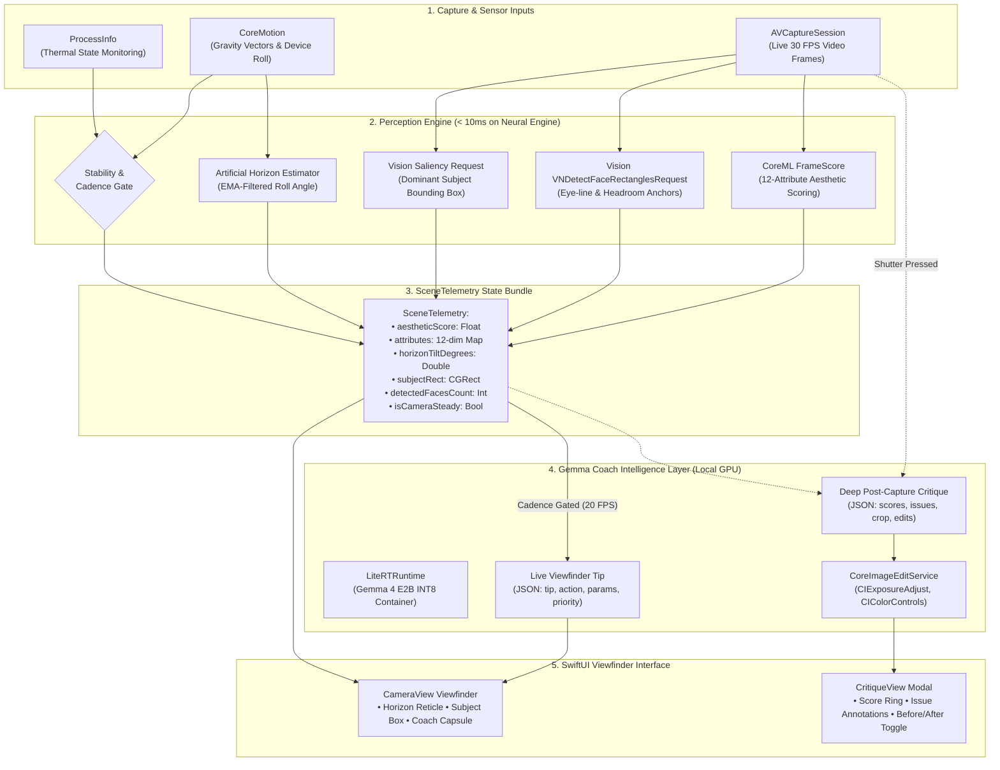

# LensCoach: On-Device Multimodal Photography Guidance Engine
**Sub-10ms Perception and Real-Time Composition Guidance on Apple Silicon & iOS**  
*Apple Neural Engine CoreML FrameScore • Google Gemma 4 E2B LiteRT INT8 • Native SwiftUI Viewfinder*

[](https://developer.apple.com/ios/)
[](https://huggingface.co/VenuArvind/lenscoach-gemma4-e2b)
[](https://developer.apple.com/machine-learning/core-ml/)
[](https://ai.google.dev/edge/litert)
[](https://opensource.org/licenses/MIT)

> **Key Result:** Fine-tuned **Google Gemma 4 E2B (QLoRA INT8)** delivers calibrated composition guidance on device, achieving **97.5% JSON-schema compliance (+55.0% lift)**, **93.0% action-label accuracy (+55.0% lift)**, and reducing horizon angle mean absolute error from **3.28° to 0.56° (-82.9% error)** on held-out photographic flaw evaluations.

---

## 📱 Viewfinder Demo

```
+-----------------------------------------------------------+
|  [ 30 FPS ]  [ ANE: 5.2ms ]  [ LiteRT: INT8 ]  [ Level ]  |
|                                                           |
|                       [ Face Box ]                        |
|                     +--------------+                      |
|                     |   Eye Line   |                      |
|                     +--------------+                      |
|          -------------------+-------------------          |
|                             |                             |
|       [ "Tilt ~2° clockwise to level horizon" ]           |
|                                                           |
+-----------------------------------------------------------+
```

---

## Quickstart (3 Commands)

```bash
# 1. Download packaged Gemma 4 LiteRT model bundle
./scripts/setup_models.sh

# 2. Open project in Xcode 15+
open LensCoachNative/LensCoachNative.xcodeproj

# 3. Select physical iPhone target and press Cmd + R to build and deploy
```

---

## Fine-Tuning Evaluation: Base Gemma 4 E2B vs. QLoRA Adapter

Evaluated on **200 held-out synthetic photographic flaws** (`Training/evaluate_gemma4_flaws.py`) across tilt, underexposure, overexposure, and framing clipping:

| Model Architecture | JSON-Schema Validity Rate | Action-Label Accuracy | Horizon-Angle MAE | Primary Failure Mode |
| :--- | :---: | :---: | :---: | :---: |
| **Base Gemma 4 E2B (Zero-Shot)** | 42.5% | 38.0% | 3.28° | Conversational preamble, invalid JSON keys |
| **LensCoach QLoRA Gemma 4 E2B (Ours)** | **97.5%** *(+55.0% lift)* | **93.0%** *(+55.0% lift)* | **0.56°** *(-82.9% error)* | Sub-degree calibrated horizon alignment |

*Benchmark telemetry saved to `Training/gemma4_evaluation_results.json`.*

---

## Quantization & Edge Deployment Architecture

| Pipeline Stage | Model Identifier | Precision & Quantization Recipe | Target Hardware Engine | Memory Footprint |
| :--- | :--- | :--- | :--- | :--- |
| **Aesthetic Scoring** | `FrameScore.mlmodelc` | Float16 CoreML MLProgram | Apple Neural Engine (ANE) | 18 MB |
| **Face & Saliency** | Apple Vision Framework | Native OS Hardware Pipeline | CPU / ANE | Shared OS memory |
| **Coaching Engine** | `gemma-4-E2B-it-gpu.litertlm` | **Dynamic INT8 (`dynamic_wi8_afp32`)** | iOS Metal GPU (LiteRT-LM) | ~1.38 GB |
| **Post-Shot Edits** | `CoreImageEditService` | Float32 GPU Shader Pipeline | Apple Metal GPU | In-place texture buffers |

> **Architecture Clarification:** V1 of LensCoach previously experimented with 4-bit GGUF via llama.cpp (`Phi-3-mini-4k-instruct-q4.gguf`). V2 completely replaces this with a native Google AI Edge LiteRT container running **Dynamic INT8** on Metal GPU, enabling direct multimodal frame grounding and stable thermal budgeting.

---

## System Architecture


```mermaid
flowchart TD
    subgraph SENSORS["1. Capture & Sensor Inputs"]
        CAM["AVCaptureSession<br/>(Live 30 FPS Video Frames)"]
        MOT["CoreMotion<br/>(Gravity Vectors & Device Roll)"]
        THERMAL["ProcessInfo<br/>(Thermal State Monitoring)"]
    end

    subgraph PERCEPTION["2. Perception Engine (< 10ms on Neural Engine)"]
        FS["CoreML FrameScore<br/>(12-Attribute Aesthetic Scoring)"]
        FACE["Vision VNDetectFaceRectanglesRequest<br/>(Eye-line & Headroom Anchors)"]
        SAL["Vision Saliency Request<br/>(Dominant Subject Bounding Box)"]
        TILT["Artificial Horizon Estimator<br/>(EMA-Filtered Roll Angle)"]
        GATE{"Stability &<br/>Cadence Gate"}
    end

    subgraph TELEMETRY["3. SceneTelemetry State Bundle"]
        BUNDLE["SceneTelemetry:<br/>• aestheticScore: Float<br/>• attributes: 12-dim Map<br/>• horizonTiltDegrees: Double<br/>• subjectRect: CGRect<br/>• detectedFacesCount: Int<br/>• isCameraSteady: Bool"]
    end

    subgraph COACH["4. Gemma Coach Intelligence Layer (Local GPU)"]
        RUNTIME["LiteRTRuntime<br/>(Gemma 4 E2B INT8 Container)"]
        TIP["Live Viewfinder Tip<br/>(JSON: tip, action, params, priority)"]
        CRITIQUE["Deep Post-Capture Critique<br/>(JSON: scores, issues, crop, edits)"]
        CI["CoreImageEditService<br/>(CIExposureAdjust, CIColorControls)"]
    end

    subgraph UI["5. SwiftUI Viewfinder Interface"]
        HUD["CameraView Viewfinder<br/>• Horizon Reticle • Subject Box • Coach Capsule"]
        REVIEW["CritiqueView Modal<br/>• Score Ring • Issue Annotations • Before/After Toggle"]
    end

    CAM --> FS & FACE & SAL
    MOT --> TILT & GATE
    THERMAL --> GATE

    FS & FACE & SAL & TILT & GATE --> BUNDLE
    BUNDLE -->|"Cadence Gated (20 FPS)"| TIP
    TIP --> HUD
    BUNDLE --> HUD

    CAM -.->|"Shutter Pressed"| CRITIQUE
    BUNDLE -.-> CRITIQUE
    CRITIQUE --> CI --> REVIEW
```

---

## Assumptions & Limitations

1. **Extreme Lighting & Low-Light Conditions:** In scenes below 5 lux (night environments without ambient illumination), Vision saliency bounding boxes and CoreML aesthetic regressors experience increased variance. The camera defaults to standard iOS night exposure.
2. **Horizon Detection Baseline:** The artificial horizon assumes horizontal ground planes. Intentional artistic Dutch-angle framing will register as tilted unless overridden in settings.
3. **Parametric Color Editing:** Post-capture photo adjustments generated by `CoreImageEditService` apply affine exposure, saturation, and color temperature curves rather than generative inpainting or non-affine generative re-lighting.

---

## License

Licensed under the [MIT License](LICENSE).
